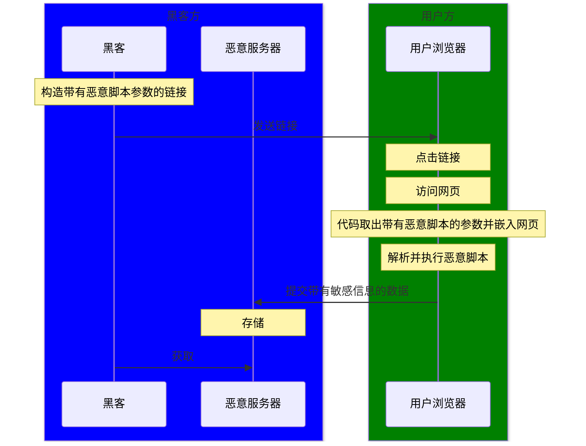

---
tags:
  - 网络安全
title: DOM 型 XSS
---

```mermaid
sequenceDiagram
box blue 黑客方
participant H as 黑客
participant HS as 恶意服务器
end
box green 用户方
participant U as 用户浏览器
end
Note over H: 构造带有恶意脚本参数的链接
H->>U: 发送链接
Note over U: 点击链接
Note over U: 访问网页
Note over U: 代码取出带有恶意脚本的参数并嵌入网页
Note over U: 解析并执行恶意脚本
U->>HS: 提交带有敏感信息的数据
Note over HS: 存储
H->>HS: 获取
```
