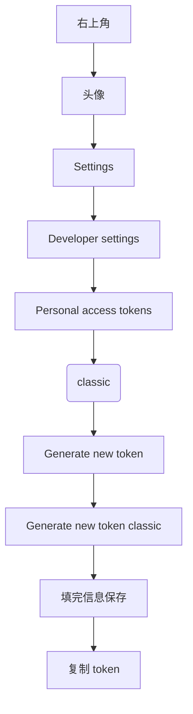

## 创建 token


```mermaid 
graph TD
右上角 --> 头像 --> Settings --> n1[Developer settings] --> n2[Personal access tokens] --> Tokens(classic) --> n3[Generate new token] --> n4[Generate new token classic] --> 填完信息保存 --> n5[复制 token]
```

## 克隆仓库

```shell
git clone https://{token}@github.com/{username}/{repository}.git
```