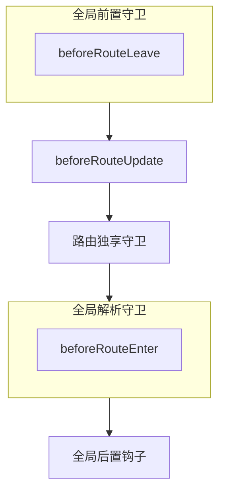

# 路由有哪些导航守卫
---
- 开始导航
      - 当前离开路由对应组件失活：组件内守卫 `beforeRouteLeave`
      - 全局前置守卫 `beforeEach`
      - 当前进入路由复用了组件：组件内守卫 `beforeRouteUpdate`
      - 路由独享守卫 `beforeEnter`
- 导航确认前
      - 解析异步路由组件：组件内守卫 `beforeRouteEnter`
      - 全局解析守卫 `beforeRouteResolve`
- 导航确认后：全局后置钩子 `afterEach`

