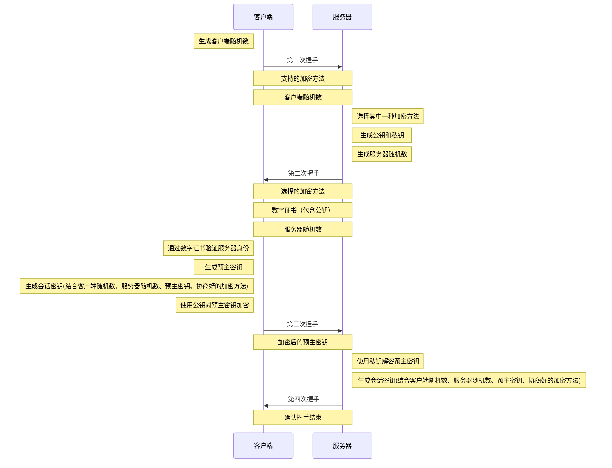

# SSL/TLS 的原理
---
握手阶段：双方使用非对称加密交换加密信息

```mermaid
sequenceDiagram
participant C as 客户端
participant S as 服务器
Note left of C : 生成客户端随机数
C ->> S : 第一次握手
Note over C,S : 支持的加密方法
Note over C,S : 客户端随机数
Note right of S : 选择其中一种加密方法
Note right of S : 生成公钥和私钥
Note right of S : 生成服务器随机数
S ->> C : 第二次握手
Note over C,S : 选择的加密方法
Note over C,S : 数字证书（包含公钥）
Note over C,S : 服务器随机数
Note left of C : 通过数字证书验证服务器身份
Note left of C : 生成预主密钥
Note left of C : 生成会话密钥(结合客户端随机数、服务器随机数、预主密钥、协商好的加密方法)
Note left of C : 使用公钥对预主密钥加密
C ->> S : 第三次握手
Note over C,S : 加密后的预主密钥
Note right of S : 使用私钥解密预主密钥
Note right of S : 生成会话密钥(结合客户端随机数、服务器随机数、预主密钥、协商好的加密方法)
S ->> C : 第四次握手
Note over C,S : 确认握手结束
```

通信阶段：双方数据使用同一会话密钥进行对称加密后再传输

