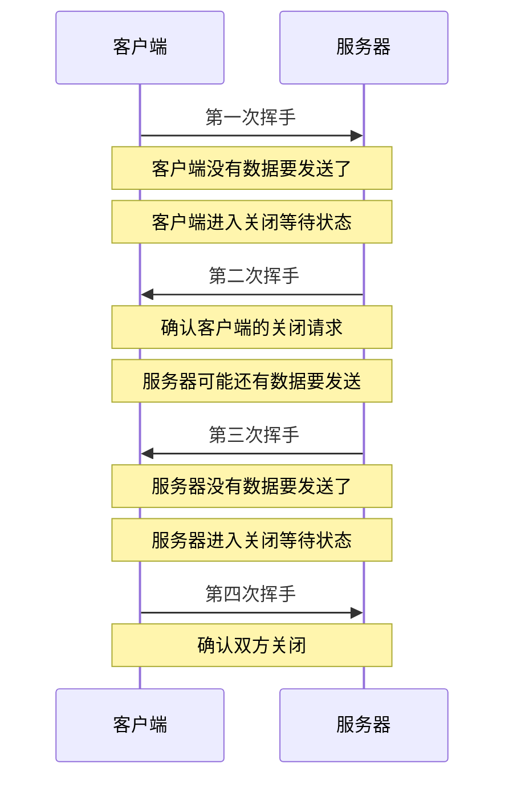

# TCP 的四次挥手

通信结束后释放连接

```mermaid
sequenceDiagram
participant C as 客户端
participant S as 服务器
C ->> S : 第一次挥手
Note over C,S : 客户端没有数据要发送了
Note over C,S : 客户端进入关闭等待状态
S ->> C : 第二次挥手
Note over C,S : 确认客户端的关闭请求
Note over C,S : 服务器可能还有数据要发送
S ->> C : 第三次挥手
Note over C,S : 服务器没有数据要发送了
Note over C,S : 服务器进入关闭等待状态
C ->> S : 第四次挥手
Note over C,S : 确认双方关闭
```