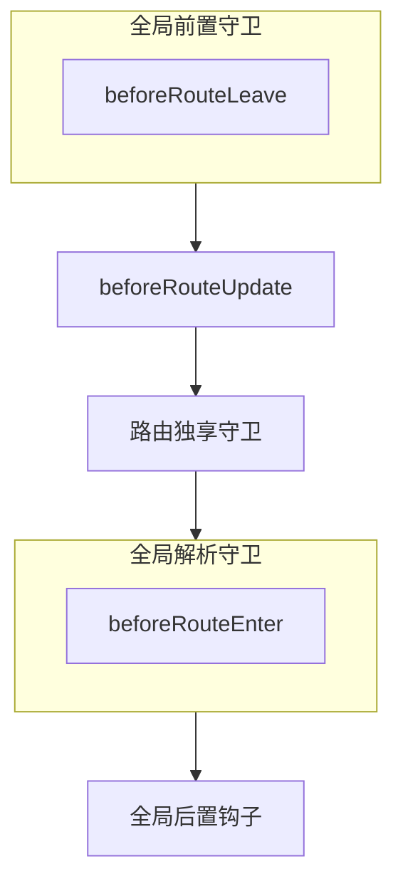

## 响应式原理

- **数据劫持**: 使用 Proxy 或 Object.defineProperty 拦截数据的读写操作, 数据变成响应式数据
- **依赖收集**: 响应式数据被访问时, 收集访问该数据的依赖, 比如组件的渲染函数
- **触发更新**: 响应式数据被修改时, 触发被收集的依赖, 然后重新渲染组件

## MVVM、MVC、MVP 的区别

- MVC:
	- 组成
		- Model: 
			- **数据管理**: 存储、更新数据
			- 通知 View 更新
		- View
			- 显示界面
			- 更新界面
			- 捕捉用户输入
		- Controller
			- **处理业务逻辑**: 决定如何通知 Model 更新数据
	- **通信流程**: 单向通信 
		- View 捕捉用户输入后通知 Controller
		- Controller 处理用户输入后调用 Model 更新数据
		- Model 通知 View 更新
	- **缺点**: View 和 Model 耦合
- MVP:
	- 组成
		- Model 
			- **数据管理**: 存储、更新数据
			- 返回数据给 Presenter
		- View
			- 显示界面
			- 捕捉用户输入
		- Presenter
			- **处理业务逻辑**: 决定如何通知 Model 更新数据
			- 更新 View
	- 通信流程
		- View 捕捉到用户输入后通知 Presenter
		- Presenter 处理用户输入后调用 Model 更新数据
		- Model 返回数据给 Presenter
		- Presenter 根据返回数据更新 View
	- **优点**: View 和 Model 之间没有直接联系
	- **缺点**: Presenter 可能会变得臃肿
- MVVM
	- 组成
		- Model
			- **数据管理**: 存储、更新数据
		- View
			- 显示界面
			- 捕捉用户输入
			- **双向绑定**: 和 ViewModel 自动同步数据
		- ViewModel
			- **处理业务逻辑**: 负责将 Model 中的数据转换给 View 使用
			- **双向绑定**: 和 View 自动同步数据
	- 通信流程
		- View 捕捉到用户输入后通知 ViewModel
		- ViewModel 处理用户输入后调用 Model 更新数据
		- Model 返回数据给 ViewModel
		- ViewModel 转换数据后自动同步到 View 上

## Computed 和 Watch 的区别

- computed
	- **依赖**: 依赖的数据发生变化自动重新计算
	- **缓存**: 缓存计算后的结果, 多次使用时不会每次都重新计算
	- **场景**: 计算派生值
- watch
	- **监听**: 监听数据的变化并执行自定义的回调函数
	- **场景**: 某个数据变化后触发额外操作, 产生副作用

## Computed 和 Methods 的区别

- computed: [[每日一题之 Vue#Computed 和 Watch 的区别|参考]]
- methods: 每次使用都会执行, 不会缓存

## v-if 和 v-show 的区别

- v-if
	- **渲染**: 条件为真则添加到 DOM, 条件为假则从 DOM 移除
	- **场景**: 条件不常改变, 初始状态不需要渲染的元素
- v-show
	- **渲染**: 通过 `display` 控制显隐
	- **场景**: 需要频繁切换显隐

## data 为什么是一个函数而不是对象

vue 组件通常是可以复用的 - 每次使用组件都会创建新的组件实例

如果 `data` 是对象 - 每个组件实例共享同一个 `data` 对象 - 一个组件实例修改 `data` 会影响其他组件实例

如果 `data` 是函数 - 每个组件实例返回一个全新的对象 - 每个组件实例互不影响

## 单页应用与多页应用的区别

- 单页应用
	- **加载**: 只有一个 HTML 文件, 页面导航时通过请求动态加载内容, 页面不会刷新
	- **体验**: 不需要刷新, 页面切换更流畅
	- **SEO**: 支持不好, 需要服务端渲染支持
- 多页应用
	- **加载**: 每个页面都有单独的 HTML 文件, 页面导航时会刷新
	- **体验**: 每次切换页面都要重新加载资源, 有明显延迟
	- **SEO**: 支持较好

## Vue 的优点

- **虚拟 DOM**: 避免不必要的 DOM 操作, 大大提升性能
- **双向数据绑定**: 数据与视图之间相互同步
- **组件化**: 将页面拆分成多个独立可复用的组件, 提升开发效率和可维护性
- **轻量级**: 体积较小

## 有哪些生命周期

- 初始化
	- **beforeCreate**: 组件实例初始化完成后
	- **created**: 状态初始化完成后
- 挂载
      - **beforeMount**: 组件挂载前, 创建和插入 DOM 节点
      - **mounted**: 组件挂载后, 组件自身 DOM 树已插入到父容器
- 更新
      - **beforeUpdate**: 更新 DOM 树前, 可以进一步更改状态
      - **updated**: 更新 DOM 树后, 可以访问 DOM 做进一步操作
- 卸载
      - **beforeUnmount**: 组件实例被卸载前, 组件实例仍保有全部功能
      - **unmount**: 组件实例被卸载后, 所有响应式作用已停止

## 子组件和父组件的执行顺序

- 初始化与挂载
      1. 父组件
         1. beforeCreate
         2. created
         3. beforeMount
      2. 子组件
         1. beforeCreate
         2. created
         3. beforeMount
         4. mounted
      3. 父组件
         1. mounted
- 更新
      1. 父组件
         1. beforeUpdate
      2. 子组件
         1. beforeUpdate
         2. updated
      3. 父组件
         1. updated
- 卸载
      1. 父组件
         1. beforeUnmount
      2. 子组件
         1. beforeUnmount
         2. unmounted
      3. 父组件
         1. unmounted
- keep-alive
	- 组件被插入到 DOM 中
		1. 父组件
			1. activated
	    2. 子组件
	         1. activated
	- 组件从 DOM 中被移除
	    1. 父组件
	         1. deactivated
		2. 子组件
	         1. deactivated

## 组件通信方式

- **Props 和 Event**: 父子组件
- **模版引用**: 父子组件
- **$parent 和 $children**: 父子组件
- **状态管理库**: 父子组件、跨层级组件、兄弟组件
- **依赖注入**: 跨层级组件

## 路由中 hash 和 history 模式的区别

- hash
	- **URL**: 带 `#` 号, `#` 后面的部分不会发送服务器
	- **原理**: 监听 `onhashchange` 事件进行导航, 不会刷新页面, 也不会向服务器发起请求, 
- history
	- **URL**: 不带 `#` 号
	- 原理: 利用 HTML5 的 history API (即 `pushState` 和 `replaceState`) 改变历史记录和 URL, 不会重新刷新页面

## 路由有哪些导航守卫

- 开始导航
      - 当前离开路由对应组件失活：组件内守卫 `beforeRouteLeave`
      - 全局前置守卫 `beforeEach`
      - 当前进入路由复用了组件：组件内守卫 `beforeRouteUpdate`
      - 路由独享守卫 `beforeEnter`
- 导航确认前
      - 解析异步路由组件：组件内守卫 `beforeRouteEnter`
      - 全局解析守卫 `beforeRouteResolve`
- 导航确认后：全局后置钩子 `afterEach`

## Vue3 有哪些更新

- **Fragment**：支持组件多个根节点
- **Teleport**：支持将一个组件内部的一部分模板“传送”到该组件的 DOM 结构外层的位置去
- **组合式 API**: 更好地组织和复用代码
- **响应式原理**：Proxy 代替 Object.defineProperty 对数据进行劫持
- **TypeScript**: 兼容性更好
- **性能**: 渲染速度更快、内存占用更小、打包体积更小

## Object.defineProperty 和 Proxy 的区别

- Object.defineProperty
	- **拦截范围**: 作用于单个属性
	- **可拦截操作**: 读取和设置
- Proxy
	- **拦截范围**: 作用于整个对象
	- **可拦截操作**: 读取、设置、删除、添加等等

## 虚拟 DOM

- **定义**: 使用 JS 对象模拟真实 DOM, 
- **性能优化**: 结合 [[每日一题之 Vue#diff 算法|diff 算法]] 比对出 DOM 中需要更新的部分, 避免不必要的 DOM 操作, 不一定比真实 DOM 性能好，因为多了一层转换过程
- **跨平台能力**: 抽象了渲染过程
 
## diff 算法

- 原则
	- **同层比较**: 只比较同一层级的节点
	- **相同节点的比较**: 判断相同的依据是 `key` 和 `tag` 是否相同, `key` 是否相同决定了节点是否能复用, 否则创建新节点
	- **最小化 DOM 操作**: 通过比对新旧 [[每日一题之 Vue#虚拟 DOM|虚拟 DOM]] 树, 只更新有变化的节点, 避免不必要的 DOM 操作
- 双端对比算法: 从新旧节点的头尾开始进行比较
	- **比较新旧头节点**：首先比较新旧 Virtual DOM 树的头节点。如果头节点相同，则进行 patch 操作（更新节点），继续比较下一个头节点。
	- **比较新旧尾节点**：如果头节点不相同，则比较尾节点。如果尾节点相同，进行 patch 操作，并继续比较下一个尾节点。
	- **比较新头和旧尾**：如果头尾都不相同，Vue 会比较新头节点和旧尾节点。如果它们相同，则进行 patch 操作，并将旧尾节点移动到头部。
	- **比较新尾和旧头**：如果以上都不匹配，Vue 会比较新尾节点和旧头节点。如果匹配，则进行 patch，并将旧头节点移动到尾部。
	- **创建或删除节点**：如果经过上述步骤仍未找到匹配的节点，Vue 会判断节点是新增还是删除，从而进行相应的 DOM 操作。

