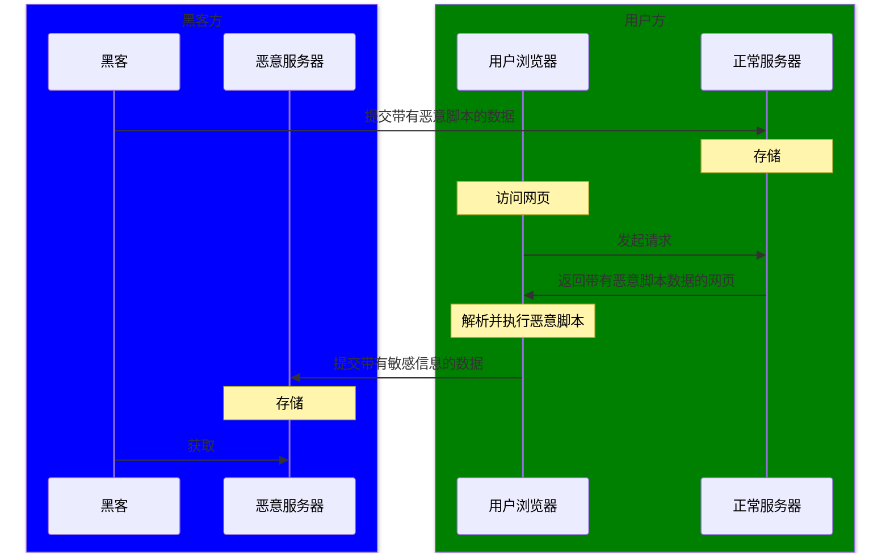
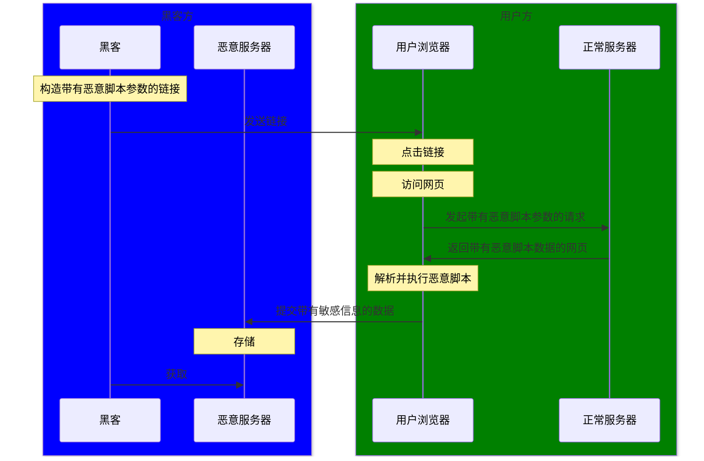
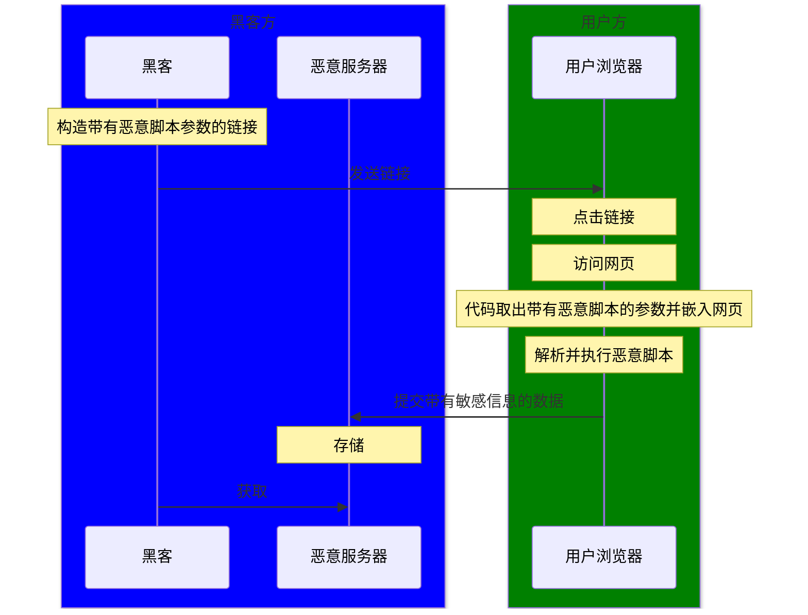

## 什么是 XSS 攻击

全称跨站脚本攻击（Cross-Site Scripting），攻击者利用网站本身的漏洞注入 JavaScript 脚本进行恶意攻击

存储型：

反射型：

DOM 型：

## 如何防御 XSS 攻击

- 过滤转义：数据库或前端对敏感字符进行过滤或转义，比如 `<` 和 `>` 转义成 `&lt` 和 `&gt`
- CSP：开启 CSP，限制外部资源的加载和内联脚本的执行
- 敏感信息：限制敏感信息的获取方式，比如 cookie 使用 `http-only`，使得脚本无法获取

## 什么是 CSRF 攻击

全称跨站请求伪造攻击（Cross-Site Request Forgery），攻击者利用用户在某个网站的身份凭证，诱导用户向该网络发起恶意请求。比如用户已在某个银行网站登录的情况下，诱导用户点击恶意链接向银行网站发起转账请求，该请求携带了用户登录后的身份凭证，使得网站误以为是本人操作

## 如何防御 CSRF 攻击

- token：用户登录后，服务器生成一个随机 token 字符串，之后在每个请求都中添加 token 头信息，服务器验证每个请求的 token，避免只通过链接就能发起请求的问题，也避免请求自动携带 cookie 的单一验证问题
- SameSite 属性：设置 cookie 的 SameSite 属性，限制跨站请求发送 cookie
- Referer 头：验证请求是从同一域名发起的

## 进程和线程的区别

- 资源分配
	- 进程：操作系统分配资源的基本单位，每个进程有自己的独立内存空间和系统资源
	- 线程：进程的执行单位，同一个进程的多个线程共享内存和系统资源
- 创建开销
	- 进程：需要分配独立资源，开销更大
	- 线程：共享同一进程资源，开销更小
- 稳定性
	- 进程：相互隔离，一个进程崩溃不会影响其他进程
	- 线程：一个线程出错可能会导致整个进程崩溃

## 浏览器缓存机制

- 首次请求资源
	- 缓存资源
	- 缓存相关响应头信息作为后续请求头
- 后续请求资源
	- 强缓存判断：是否允许浏览器直接使用本地缓存的资源，而无需向服务器发送请求，适用于不常改动的静态资源
		- 优先判断请求头 `Cache-Control` 的 `max-age`：缓存有效的时间长度
		- 判断请求头 `Expires`：表示缓存失效的具体日期时间
	- 协商缓存判断：请求服务器是否需要重新下载资源，不需要则返回 304，表示可以继续使用本地缓存的资源，适用于随时可能改动的资源
		- 优先判断请求头 `If-Node-Match`：表示资源的唯一标识符, 资源内容没有改动就不会变，服务器将其与响应头 `Etag` 比对
		- 判断请求头 `If-Modified-Since`：表示资源的最后修改时间, 服务器将其与响应头 `Last-modified` 比对

## 常见浏览器内核

- Chrome、Edge 浏览器：Blink 内核，Webkit 内核的分支
- Firfox 浏览器：俗称 Firfox 内核
- Safari 浏览器：Webkit 内核
- IE 浏览器：俗称 IE 内核

## 浏览器渲染过程

- **构建 DOM 树**：解析 HTML
- **构建 CSSOM 树**：解析 CSS
- **构建渲染树**：结合 DOM 树和 CSSOM 树，只包含可见节点
- **布局**：计算每个渲染树节点的大小和位置，又称为**重排**
- **分层**：针对特殊的节点生成专用的图层，比如绝对定位 
- **绘制**：将每个图层的节点转换为实际像素，又称为**重绘**
- **合成**：将绘制好的每个图层层叠在一起

## 浏览器渲染优化

- JavaScript：加载 JavaScript 会阻塞 HTML 和 CSS 的解析
	- `<script>` 标签放在底部
	- 使用 `async` 异步加载或 `defer` 异步加载并延迟执行
	- 压缩合并资源，加快请求速度
- DOM
	- 避免过多 DOM 节点
	- 避免频繁操作 DOM 节点，减少重排重绘
	- 避免穿插对 DOM 节点的读写操作，，减少重排重绘

## 浏览器存储方式

- Cookies
	- 特性
		- 无法跨域
		- 每次发起请求都会携带
		- 每个域名不能超过 20 个，每个大小不能超过 4kb
	- 场景
		- 保存登录状态
		- 保存用户偏好
- 本地存储（LocalStorage）
	- 特性
		- 总容量为 5MB - 10MB
		- 请求不会携带
		- 浏览器关闭也不会清除，除非手动清除
	- 场景
		- 保存用户偏好
		- 保存大量非敏感数据
- 会话存储（SessionStorage）
	- 特性
		- 和本地存储类似
		- 浏览器关闭会自动清除
	- 场景
		- 临时保存敏感数据
		- 保存导航状态

## 什么是同源策略

浏览器的安全机制

- 同源：两个 URL 之间的协议、域名、端口一致
- 限制
	- 当前域的脚本不能访问其他域的存储数据
	- 当前域的脚本不能操作访问其他域的 DOM
	- 当前域无法通过 ajax 向其他域发送请求
- 场景：防止 XSS 攻击
- 例外
	- img 标签
	- script 标签
	- CORS

## 如何解决跨域问题

- [[每日一题之浏览器原理#CORS|CORS]]
- [[每日一题之浏览器原理#JSONP|JSONP]] 
- [[每日一题之浏览器原理#nginx|nginx]]

## 什么是事件

用户操作网页时发生的交互, 包括:

- 鼠标事件
- 键盘事件
- 窗口事件

事件通过**事件模型**进行管理, 决定了事件在 DOM 中从触发到处理的过程, 包括:

- 冒泡事件模型: 事件从目标元素开始触发, 逐级向上传播, 直到到达根元素
- 捕获事件模型: 从根元素开始触发, 逐级向下传播, 直到到达目标元素

不同事件模型下, 事件传播过程都经历三个阶段:

- 捕获阶段: 事件从根元素向目标元素传播, 捕获事件模型下, 事件从这个阶段开始触发
- 目标阶段: 事件在目标元素上触发, 冒泡事件模型下, 事件从这个阶段开始触发
- 冒泡阶段: 事件从目标元素向根元素传播

## 什么是事件委托

利用事件冒泡特性将事件绑定到父元素上, 而不是绑定到目标元素本身, 通过 `event.target` 判断哪个子元素触发了事件, 在处理大量相似子元素时能减少绑定的事件数量, 节省内存

## 什么是事件循环

事件循环是处理异步任务的机制, 包含以下概念:

- 宏任务队列: 存放异步任务的回调函数, 包括事件回调, 定时器回调等
- 调用栈: JavaScript 是单线程的, 即同一时间内只能执行一个函数, 调用栈用于存放当前正在执行的函数, 又叫同步任务, 每当一个函数被调用则压入调用栈, 函数执行完从栈中弹出, 嵌套函数同理
- 微任务队列: 存放比宏任务优先级更高的异步任务回调函数, 比如 Promise 回调, MutationObserver 回调

处理过程遵循以下步骤:

1. 清空调用栈: 依次执行调用栈中的同步任务, 过程中遇到异步任务, 将回调存放到对应任务队列中
2. 清空微任务队列: 清空调用栈后, 优先一次性执行完所有微任务, 依次从微任务队列取出回调压入调用栈中
3. 渲染: 清空微任务队列, 如果需要, 浏览器会尝试进行页面渲染
4. 处理宏任务队列: 每次只取一个任务执行, 压入调用栈, 回到最开始的步骤

---

## 备注

### CORS

正常情况下, 因为同源策略是浏览器的机制, 需要让浏览器判断资源是同源的才会去访问, 但通过 CORS 可以绕过这个机制

CORS 就是在发起跨域请求时让服务器返回特定的响应头给浏览器, 让浏览器判断是否可以放心地获取来自不同源的资源, 这些响应头包括:

- Access-Control-Allow-Origin: 指定允许访问资源的域
- Access-Control-Allow-Methods: 指定允许的[[每日一题之计算机网络#常见的 HTTP 请求方法|请求方法]]
- Access-Control-Allow-Headers: 指定允许的自定义请求头
- Access-Control-Allow-Credentials: 指定是否允许发送凭证, 比如 Cookie

跨域请求存在两种请求类型, 分别是**简单请求**和**预检请求**

简单请求是指浏览器只检查 `Accless-Control-Allow-Origin` 响应头来决定是否允许跨域的请求, 需要符合以下条件: 

- 请求方法: 只包括 `GET`、`POST`、`HEAD`
- 请求头: 只包括 `Accept`、`Content-type` 等基本请求头, 其中 `Content-Type` 只能是 `text/plain`、`application/x-www-form-urlencoded`、`multipart/form-data`

预检请求是指简单请求以外的请求, 会先发起 `OPTIONS` 请求询问服务器是否允许跨域请求, 浏览器通过判断服务器返回的头来判断是否继续发起实际请求, 比如 `Access-Control-Allow-Headers` 、`Access-Control-Allow-Methods` 等

### JSONP

利用 `script` 标签没有跨域限制的机制, 发送带有 `callback` 参数的 `GET` 请求, `callback` 参数值为当前域下声明的函数名, 该请求加载一个脚本, 该脚本加载后会自动调用 `callback` 参数对应的函数, 并将数据作为函数调用时的参数, 进而能在函数内部拿到不同源的数据

有一定局限性:

- 只能发起 `GET` 请求: `script` 标签不能用于 `POST` 请求
- 有安全隐患: 执行外部脚本容易收到 [[每日一题之浏览器原理#什么是 XSS 攻击| XSS 攻击]]

### nginx

通过反向代理转发请求, 代替资源所在的服务器添加相关允许跨域的响应头来实现跨域, 客户端不知道资源所在服务器有没有添加相关响应头