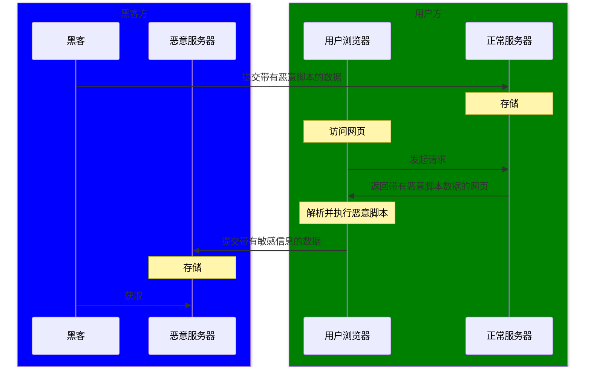
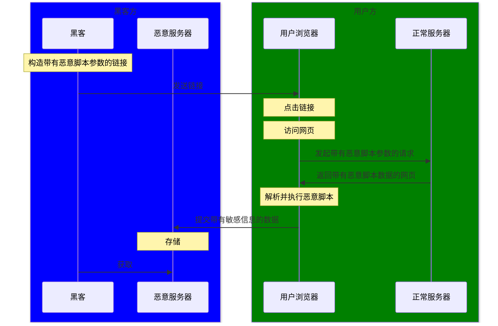
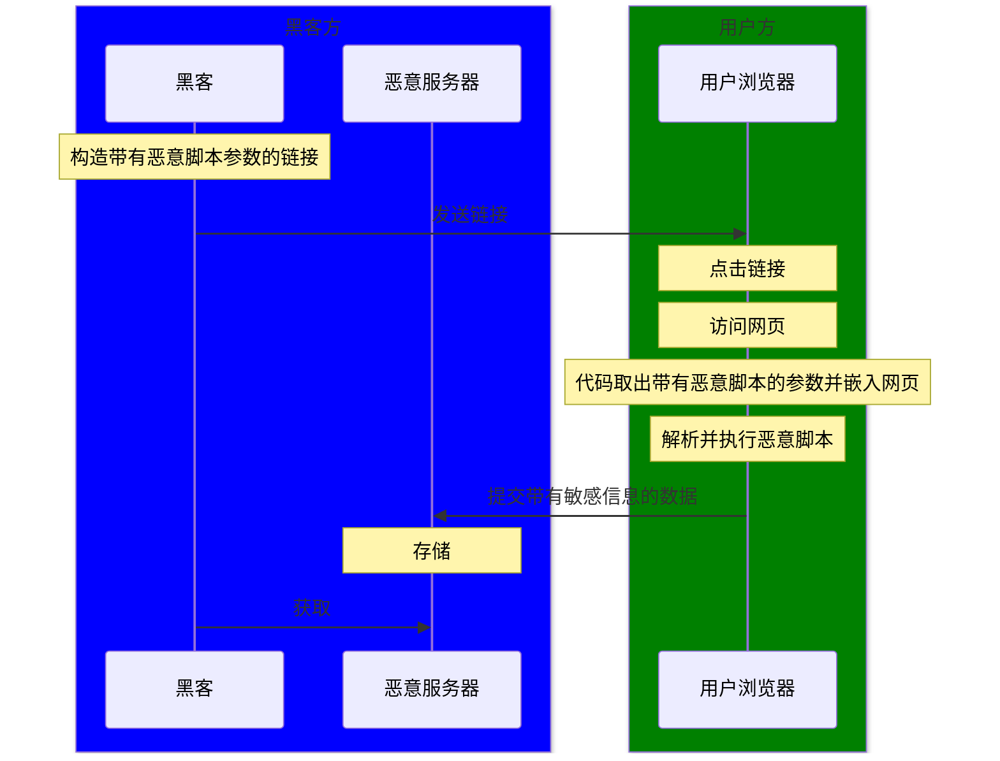

## 什么是 XSS 攻击

全称跨站脚本攻击（Cross-Site Scripting）：攻击者利用网站本身的漏洞注入 JavaScript 脚本进行恶意攻击

存储型：

```mermaid
sequenceDiagram
box blue 黑客方
participant H as 黑客
participant HS as 恶意服务器
end
box green 用户方
participant U as 用户浏览器
participant US as 正常服务器
end
H->>US:提交带有恶意脚本的数据
Note over US:存储
Note over U:访问网页
U->>US:发起请求
US->>U:返回带有恶意脚本数据的网页
Note over U:解析并执行恶意脚本
U->>HS:提交带有敏感信息的数据
Note over HS:存储
H->>HS:获取
```

反射型：

```mermaid
sequenceDiagram
box blue 黑客方
participant H as 黑客
participant HS as 恶意服务器
end
box green 用户方
participant U as 用户浏览器
participant US as 正常服务器
end
Note over H: 构造带有恶意脚本参数的链接
H->>U: 发送链接
Note over U: 点击链接
Note over U: 访问网页
U->>US: 发起带有恶意脚本参数的请求
US->>U: 返回带有恶意脚本数据的网页
Note over U: 解析并执行恶意脚本
U->>HS: 提交带有敏感信息的数据
Note over HS: 存储
H->>HS: 获取
```

DOM 型：

```mermaid
sequenceDiagram
box blue 黑客方
participant H as 黑客
participant HS as 恶意服务器
end
box green 用户方
participant U as 用户浏览器
end
Note over H: 构造带有恶意脚本参数的链接
H->>U: 发送链接
Note over U: 点击链接
Note over U: 访问网页
Note over U: 代码取出带有恶意脚本的参数并嵌入网页
Note over U: 解析并执行恶意脚本
U->>HS: 提交带有敏感信息的数据
Note over HS: 存储
H->>HS: 获取
```

