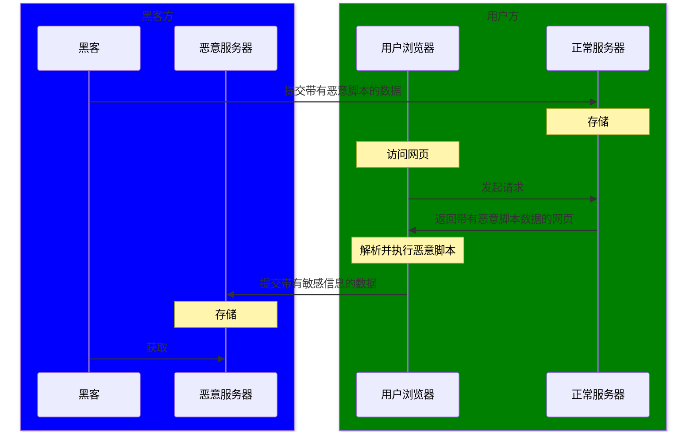
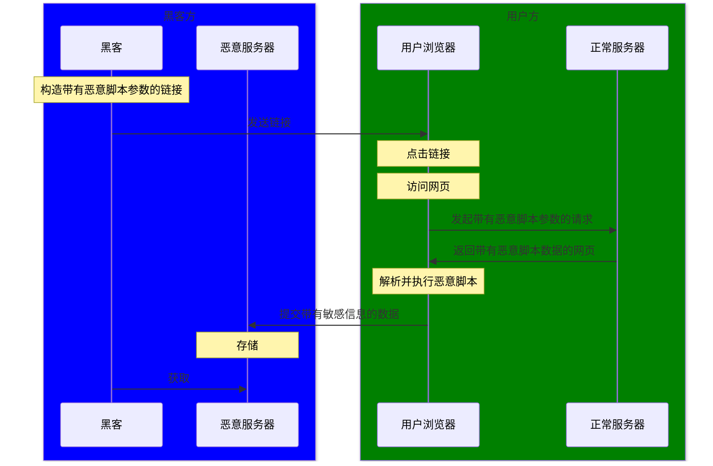
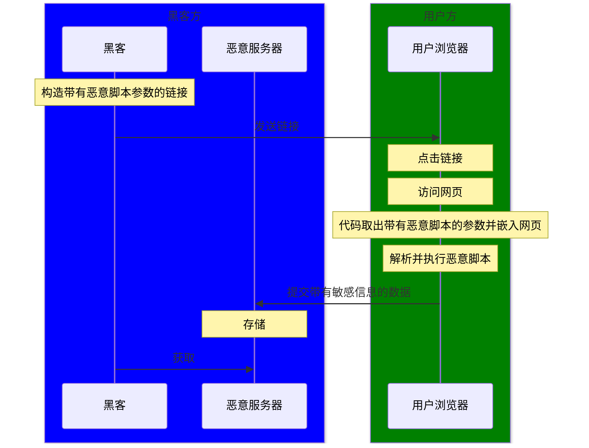

## 什么是 XSS 攻击

全称跨站脚本攻击（Cross-Site Scripting），攻击者利用网站本身的漏洞注入 JavaScript 脚本进行恶意攻击

存储型：

反射型：

DOM 型：

## 如何防御 XSS 攻击

- 过滤转义：数据库或前端对敏感字符进行过滤或转义，比如 `<` 和 `>` 转义成 `&lt` 和 `&gt`
- CSP：开启 CSP，限制外部资源的加载和内联脚本的执行
- 敏感信息：限制敏感信息的获取方式，比如 cookie 使用 `http-only`，使得脚本无法获取

## 什么是 CSRF 攻击

全称跨站请求伪造攻击（Cross-Site Request Forgery），攻击者利用用户在某个网站的身份凭证，诱导用户向该网络发起恶意请求。比如用户已在某个银行网站登录的情况下，诱导用户点击恶意链接向银行网站发起转账请求，该请求携带了用户登录后的身份凭证，使得网站误以为是本人操作

## 如何防御 CSRF 攻击

- token：用户登录后，服务器生成一个随机 token 字符串，之后在每个请求都中添加 token 头信息，服务器验证每个请求的 token，避免只通过链接就能发起请求的问题，也避免请求自动携带 cookie 的单一验证问题
- SameSite 属性：设置 cookie 的 SameSite 属性，限制跨站请求发送 cookie
- Referer 头：验证请求是从同一域名发起的