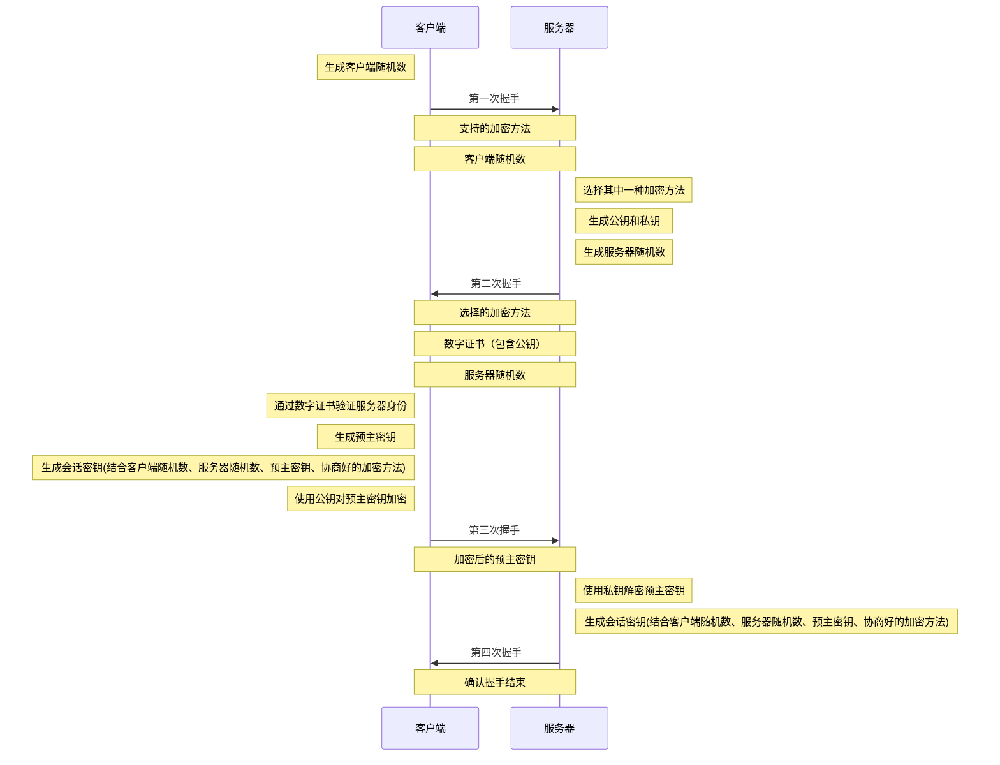
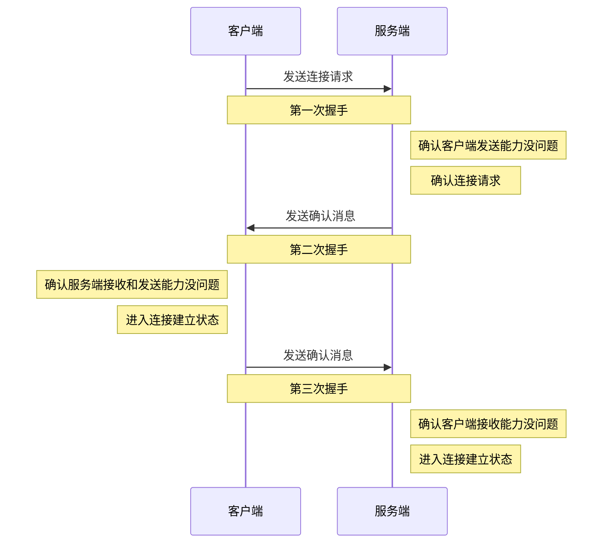
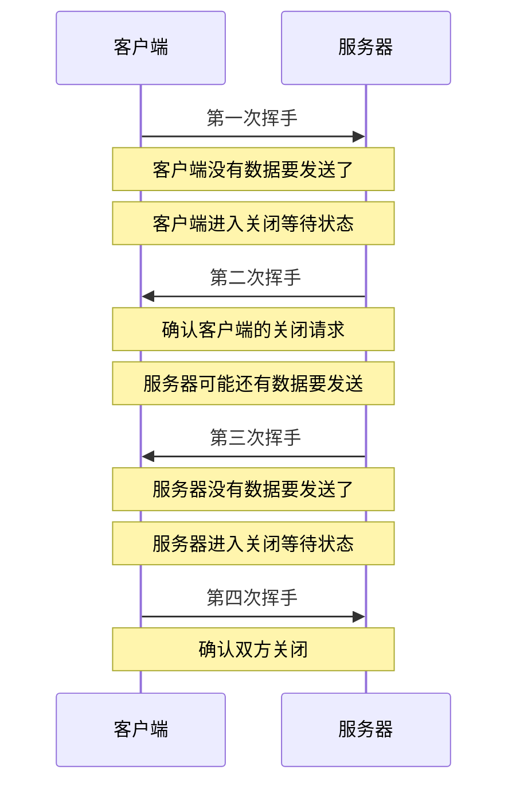

## GET 和 POST 的区别

- 应用场景
	- GET: 幂等的, 不会影响服务器资源, 比如请求网页资源
	- POST: 非幂等的, 会影响服务器资源, 比如注册用户
- 缓存
	- GET: 默认会缓存, 除非请求头或响应头指定不缓存
	- POST: 默认不缓存也不推荐缓存, 因为会影响服务器资源导致数据不一致
- 报文实体
	- GET: 报文实体为空
	- POST: 报文实体为向服务器发送的数据
- 安全性
	- GET: 相对不安全, 因为请求数据暴露在 URL 中形成历史记录
	- POST: 相对安全, 虽然也是明文传输但请求数据不会暴露在 URL 中形成历史记录
- 请求数据量
	- GET: URL 长度受浏览器限制, 进而影响请求数据量
	- POST: 请求数据量不受限制, 因此适合文件上传或复杂的表单数据
- 参数类型
	- GET: 只能以键值对字符串形式
	- POST: 支持更多类型

## 常见的 HTTP 请求方法

- GET: 获取资源
- POST: 创建资源
- PUT: 更新资源
- DELETE: 删除资源
- HEAD: 相比 GET, 只获取响应头
	- 检查资源是否存在
	- 检查资源元数据
	- 验证缓存是否有效
- OPTIONS: 跨域请求中发起预检请求，询问资源支持的请求方法和请求头
- CONNECT: 要求代理服务器与目标服务器建立 TCP 连接隧道, 之后代理服务器只负责转发
- TRACE: 让服务器返回客户端的原始请求, 诊断是否在传输过程中被修改

## HTTP 1.0 和 HTTP 1.1 的区别

- 连接
	- 1.0: 非持久连接, 每次请求都需要重新建立 TCP 连接
	- 1.1: 持久连接, 多个请求可以复用一个 TCP 连接
- host 字段
	- 1.0: 认为每台服务器只有一个网站，请求时默认只请求那个网站
	- 1.1: 服务器因为虚拟主机技术的存在可以实现同一个 IP 托管多个域名网站, 又因为客户端请求时域名会被 DNS 解析成 IP 再与服务器通信, 服务器只知道客户端请求了自己的 IP, 并不知道请求的原始 URL，在同一个 IP 下托管多个域名网站的情况下无法只是根据 IP 判断出客户端请求的网站，因此需要 `host` 字段进行区分
- 请求方法
	- 1.0: 只支持 `GET`、`POST` 和 `HEAD`
	- 1.1: 新增 `PUT`、`DELETE`、`OPTIONS` 等
- [[浏览器缓存]]
	- 1.0: 使用 `If-Modified-Since`、`expires` 字段进行缓存控制
	- 1.1: 新增了 `Etag`、`If-Unmodified-Since`、`If-Match`、`If-None-Match` 字段，提供更细粒度的缓存控制

## HTTP 1.1 和 HTTP 2.0 的区别

- 多路复用
	- 1.1: 同一个 TCP 连接同一时间内只能处理一个请求, 上一个请求完成才能处理下一个
	- 2.0: 支持多路复用, 同一个 TCP 连接可以并行处理多个请求
- 二进制格式
	- 1.1: 使用纯文本传输数据
	- 2.0: 使用二进制帧传输, 是多路复用的基础, 将同一个 TCP 连接上的多个请求数据拆分成若干个帧, 用编号区分来自于哪个请求, 最后合并成一个完整的请求
- 头部压缩
	- 1.1: 每次请求都发送所有字段, 导致部分字段重复, 增加带宽消耗
	- 2.0: 引入了头部压缩, 减少数据包体积
- 服务器推送
	- 1.1: 客户端必须主动发起请求才能获取数据
	- 2.0: 允许服务器主动提前推送静态资源到客户端, 提升页面加载速度

## HTTP 和 HTTPS 的区别

- 端口
	- HTTP: 80
	- HTTPS: 443
- 安全性
	- HTTP: 明文传输
	- HTTPS: 使用 SSL 协议加密数据, 更安全
- 证书
	- HTTP: 不需要
	- HTTPS: 需要 SSL 证书来验证服务器身份和加密通信

## 输入 URL 并回车会发生什么

- URL 解析
- [[浏览器缓存]]判断
---
- **DNS 解析**：获取域名对应 ip
- **MAC 地址解析**：获取物理地址
- **TCP 连接建立**： [[每日一题之计算机网络#TCP 的三次握手|TCP 三次握手]]
- **HTTPS 握手**：TLS 四次握手
---
- 数据返回
- [[浏览器渲染]]
- **请求释放**：TCP 四次挥手

## HTTP 请求报文由什么组成

- 请求行
	- [[每日一题之计算机网络#常见的 HTTP 请求方法|请求方法]]
	- URI: URL 的一部分，标识资源位置
	- 协议版本
		- [[每日一题之计算机网络#HTTP 1.0 和 HTTP 1.1 的区别|HTTP 1.1]]
		- [[每日一题之计算机网络#HTTP 1.1 和 HTTP 2.0 的区别|HTTP 2.0]]
- 请求头部：多个字段键值对
- 空行：分隔请求头部和请求体
- 请求体：客户端发送给服务器的数据

## HTTP 响应报文由什么组成

- 响应行
	- 协议版本
		- [[每日一题之计算机网络#HTTP 1.0 和 HTTP 1.1 的区别|HTTP 1.1]]
		- [[每日一题之计算机网络#HTTP 1.1 和 HTTP 2.0 的区别|HTTP 2.0]]
	 - [[每日一题之计算机网络#常见的 HTTP 状态码|状态码]]
	 - 状态描述：对状态码的简短描述
- 响应头部：多个字段键值对
- 空行：分隔响应头部和响应体
- 响应体：服务器返回给客户端的数据

## HTTPS 协议有什么作用

- 加密通信：在 HTTP 的基础上通过 SSL/TLS 加密传输的数据
- 完整性校验：校验数据的完整性，防止篡改和损坏
- 身份验证：验证服务器的身份，确保不是伪装的服务器

## SSL/TLS 的原理

握手阶段：双方使用非对称加密交换加密信息

通信阶段：双方数据使用同一会话密钥进行对称加密后再传输

## HTTPS 如何保证安全

- 对称加密：传输过程中双方使用相同的密钥加密数据，优点是加密速度快点，但密钥可能在传输过程中被拦截
- 非对称加密：使用公钥和私钥，公钥加密的数据只能用私钥解密，只传输公钥，不传私钥，保证即使公钥被拦截也不能解密传输数据，但加密速度没有对称加密快
- 数字证书：公钥在传输过程也能被拦截篡改，因此需要将公钥包含在数字证书中，客户端通过数字证书验证服务器身份再使用公钥

综上所述，通过使用非对称加密的公钥加密来自对称加密的密钥，保证安全的同时也保证了加密速度，同时通过数字证书验证服务器的身份，保证公钥的安全

## 常见的 HTTP 状态码

- **1xx**：请求正在处理
- **2xx**：请求正常处理完毕
    - **200**：请求成功
    - **201**：通常是 POST 请求成功
- **3xx**：重定向
    - **301**：永久重定向
    - **302**：临时重定向
    - **304**：资源未修改，继续使用缓存资源
- **4xx**：客户端错误
    - **400**：请求语法有误
    - **401**：身份验证未通过
    - **403**：拒绝请求
    - **404**：找不到资源
    - **405**：请求方法不支持
- **5xx**：服务器错误
    - **500**：服务器内部错误
    - **502**：服务器崩溃

## DNS 是什么

DNS 即域名系统，负责将客户端访问的域名解析成 IP 才能访问指定服务器，方便人们使用更容易记忆的域名访问网站，而不是 IP 数字串

## DNS 的查询过程

- 浏览器缓存
- 本地 DNS 服务器
- 根域名服务器
- 顶级域名服务器
- 权威域名服务器
- 缓存查询结果
- 返回查询结果

## TCP 的三次握手

## TCP 的四次挥手

