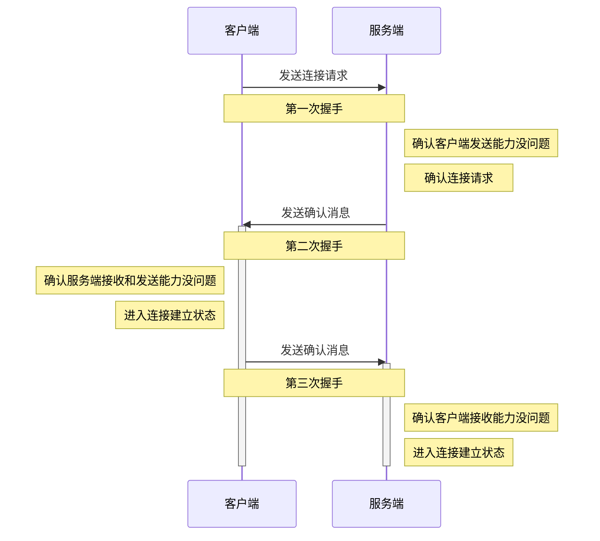

```mermaid
sequenceDiagram
participant C as 客户端
participant S as 服务端
C ->> S:发送连接请求
Note over C,S :第一次握手
Note right of S:确认客户端发送能力没问题
Note right of S:确认连接请求
S ->> C:发送确认消息
activate C
Note over C,S :第二次握手
Note left of C:确认服务端接收和发送能力没问题
Note left of C:进入连接建立状态
C ->> S:发送确认消息
activate S
Note over C,S :第三次握手
Note right of S:确认客户端接收能力没问题
Note right of S:进入连接建立状态
deactivate C
deactivate S
```
