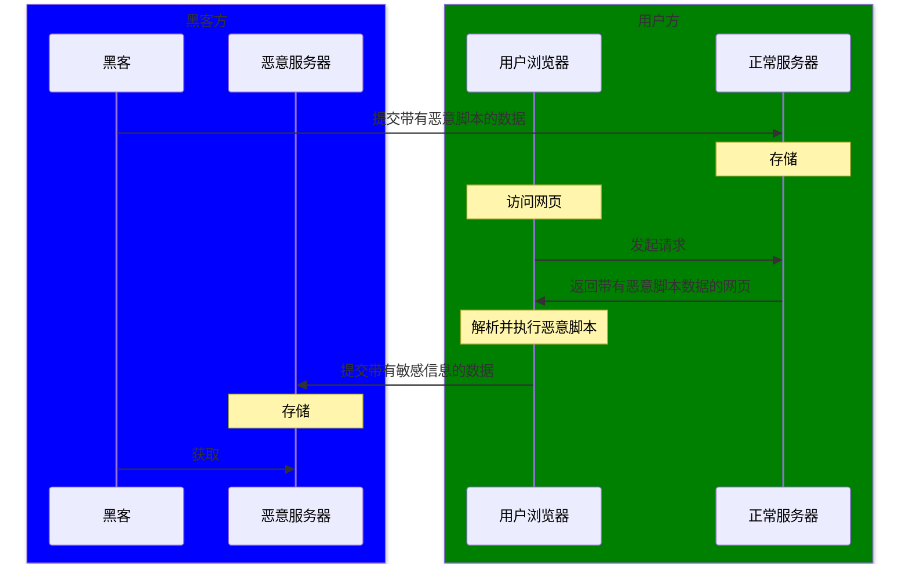

```mermaid
sequenceDiagram
box blue 黑客方
participant H as 黑客
participant HS as 恶意服务器
end
box green 用户方
participant U as 用户浏览器
participant US as 正常服务器
end
H->>US:提交带有恶意脚本的数据
Note over US:存储
Note over U:访问网页
U->>US:发起请求
US->>U:返回带有恶意脚本数据的网页
Note over U:解析并执行恶意脚本
U->>HS:提交带有敏感信息的数据
Note over HS:存储
H->>HS:获取
```

